# UX interaction and class diagrams

These diagrams describe the touch UI in `src/ColorController/`. They show which
component owns each interaction, how semantic events reach controller services,
and where rendering and state live.

## Screen layout

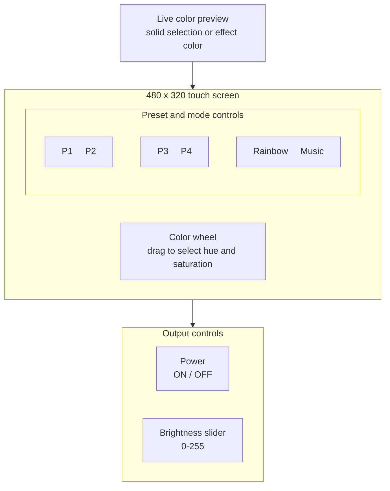

| Element | Touch behavior | Owned by |
|---|---|---|
| Color wheel | Press and drag immediately select a solid color | `ColorWheelControl` |
| P1-P4 | Tap recalls; hold inside for 700 ms stores; release outside cancels | `PresetButtonControl` |
| Rainbow | Release inside selects rainbow mode | `ModeButtonControl` |
| Music | Release inside selects music mode | `ModeButtonControl` |
| Power | Release inside toggles output | `PowerButtonControl` |
| Brightness | Press and drag update brightness | `BrightnessSliderControl` |
| Preview strip | Displays the selected or current effect color | `ColorPreviewControl` |

## Touch contact lifecycle

The touch controller can briefly report no contact while a finger is still on
the panel. Release debounce keeps that noise from splitting one gesture into
multiple presses.

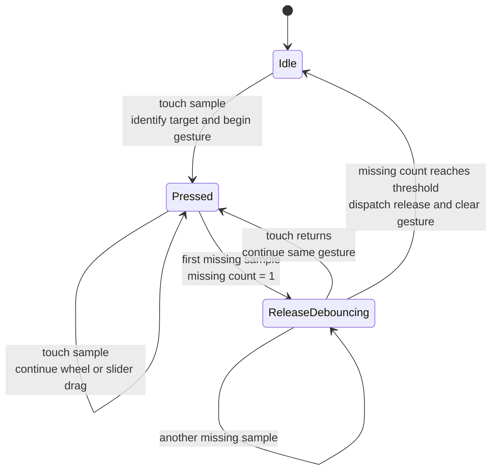

## Touch target and event routing

Controls own hit testing, value mapping, local gesture state, and drawing.
`TouchDispatcher` owns pointer capture and `UiActionProcessor` owns application side effects.

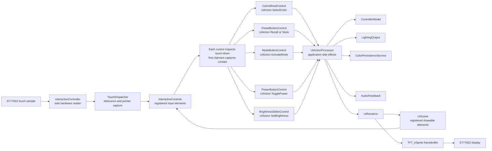

### Non-overlapping touch regions

Interactive controls must not overlap. This is a layout requirement, not a
runtime arbitration feature. Registration order must never be used to decide
which of two visible controls receives a contact:

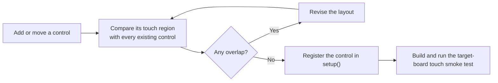

## Preset and mode interaction state

Each `PresetButtonControl` combines its geometry and drawing with a
hardware-independent `PresetGesture`. The button emits intent only; it does not
change the model or perform I/O.

Moving outside pauses hold eligibility and prevents an outside release from
recalling. Returning inside before release resumes the same gesture; if the
total elapsed hold time has reached 700 ms, the preset stores immediately.

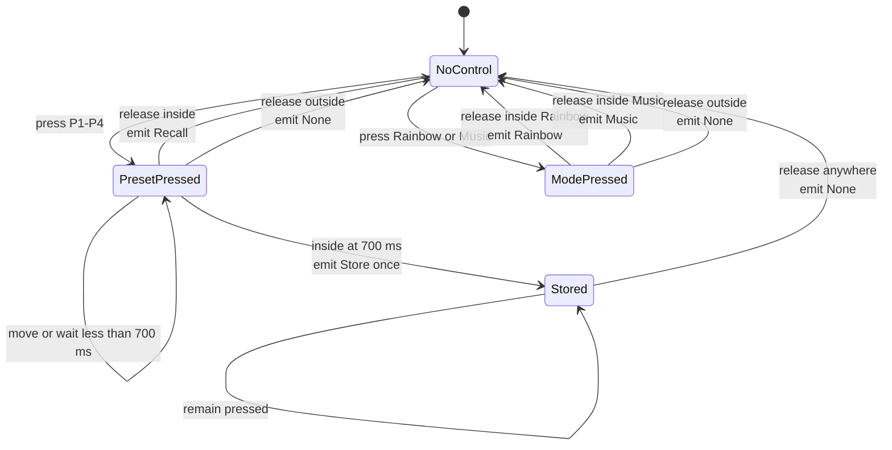

### Preset event side effects

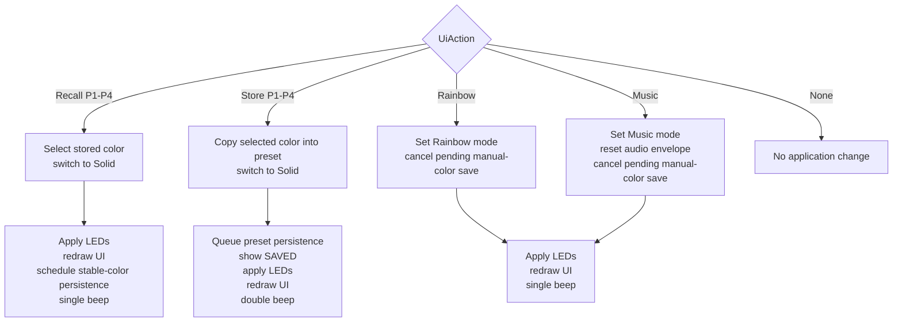

## Common interaction sequences

### Dragging the color wheel

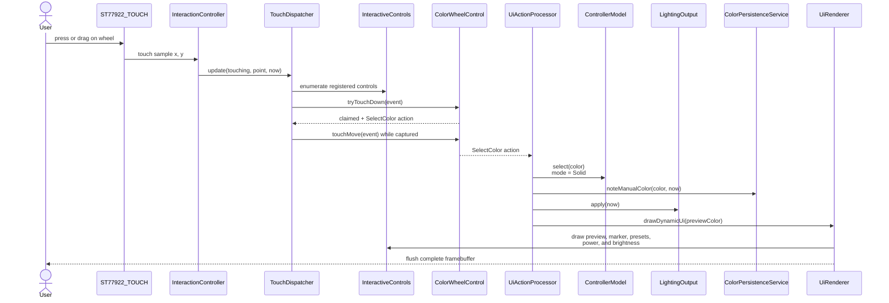

### Holding a preset to store

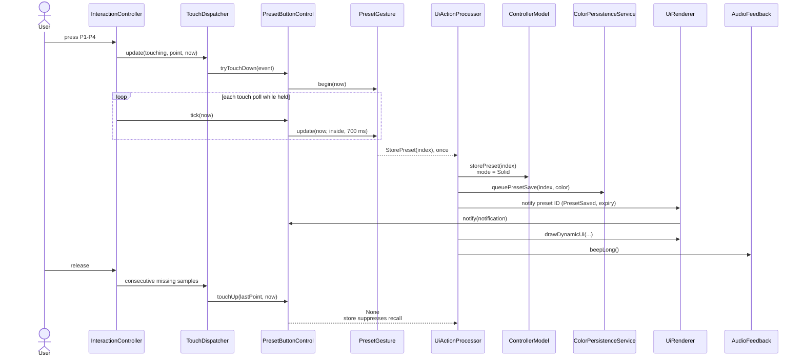

### Microphone status and Music

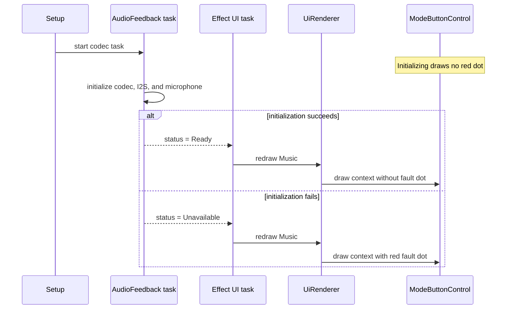

## Runtime task interaction

Arduino `loop()` only polls SimpleAwait. Each steady-state task suspends for a
positive duration so the scheduler can idle and ESP-IDF work remains responsive.

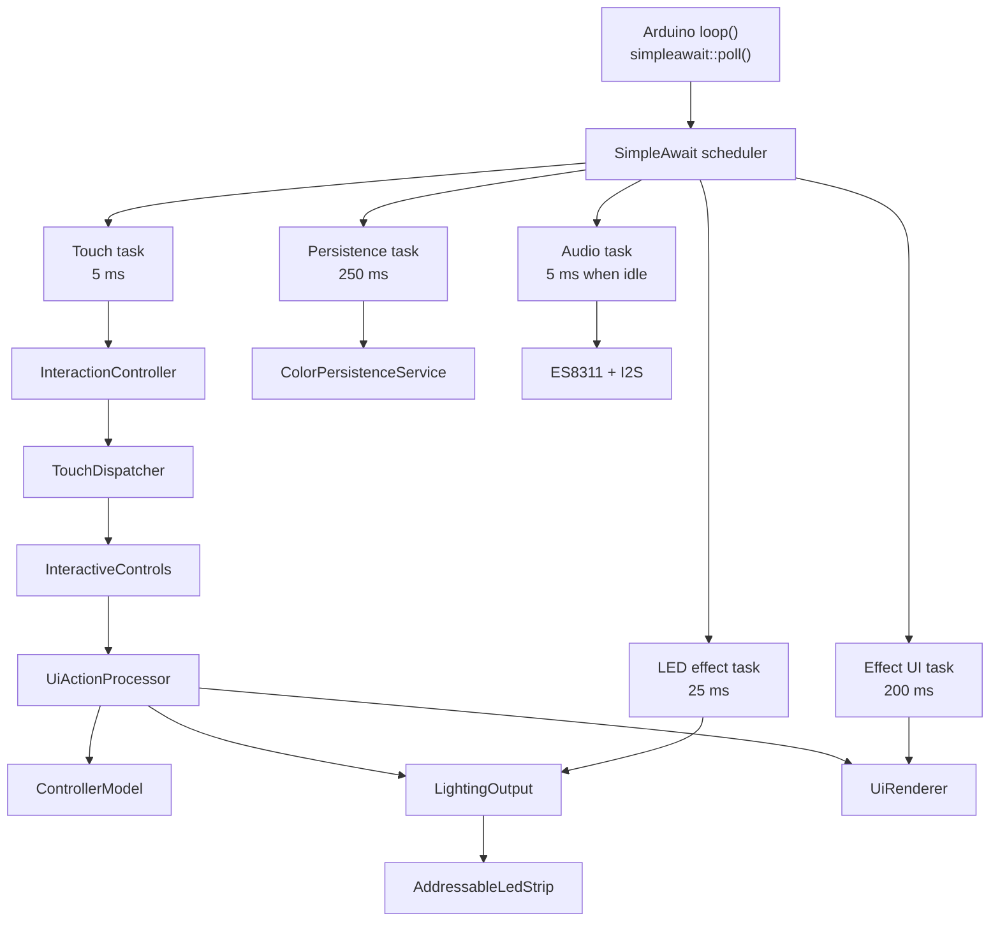

## Class diagrams

The editable PlantUML sources are stored beside the generated SVGs in
[`docs/diagrams/`](diagrams/).

### Touch UI controls

[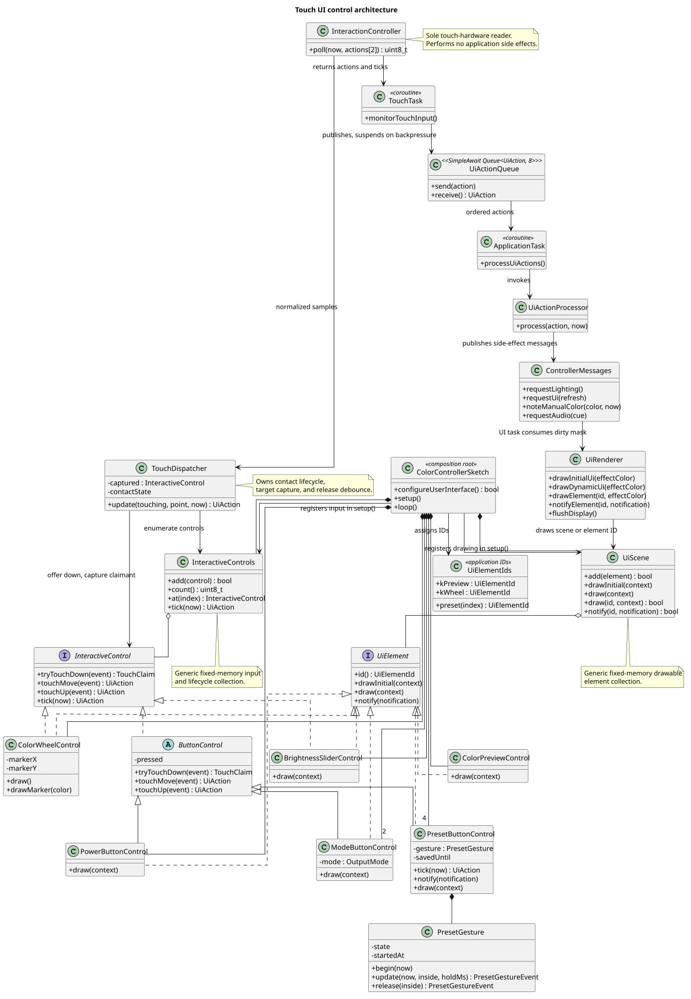](diagrams/ui-control-classes.svg)

Source: [`ui-control-classes.puml`](diagrams/ui-control-classes.puml)

### Runtime and services

[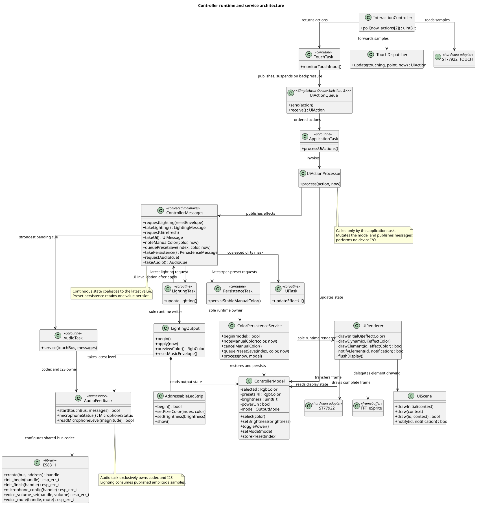](diagrams/runtime-classes.svg)

Source: [`runtime-classes.puml`](diagrams/runtime-classes.puml)

## Ownership rules

1. Controls own geometry, hit testing, mapping, drawing, and local interaction state.
2. Controls emit values or semantic events; they do not write NVS or operate LEDs/audio.
3. Every interactive control receives touch-down data and decides whether to claim it.
4. `TouchDispatcher` preserves the sole claimant through release debounce; layout rules prohibit overlapping controls.
5. `UiActionProcessor` converts control actions into application side effects.
6. `ControllerModel` is the source of truth for selected color, brightness, power, mode, and presets.
7. `UiRenderer` supplies a consistent render context and coordinates complete framebuffer transfers;
   `UiScene` owns ordered element drawing.
8. The sketch owns and visibly composes individual controls, registering interactive elements with
   `InteractiveControls` and drawable elements with `UiScene`.
9. Both collections store interface pointers only and have no knowledge of concrete control types.
10. The sketch passes geometry into each element, which uses the same bounds for drawing and hit testing.
11. Drawable-only elements such as the preview participate in scene order without appearing in the
    touch collection.
